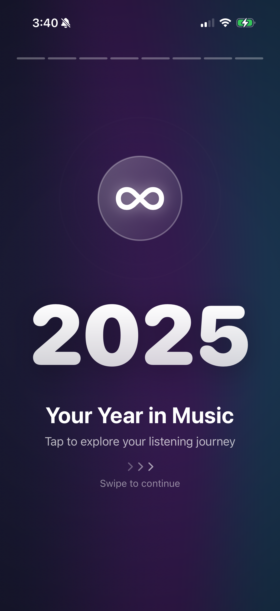
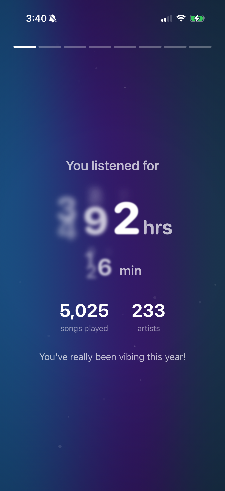
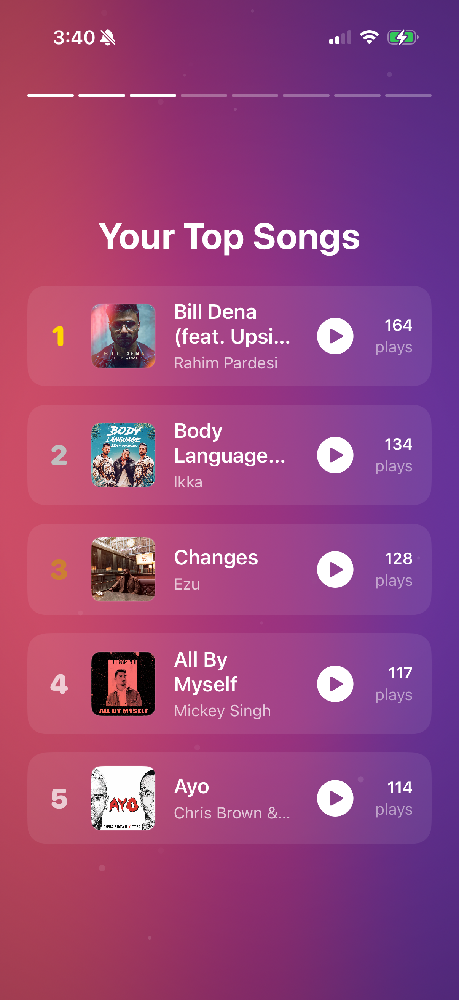
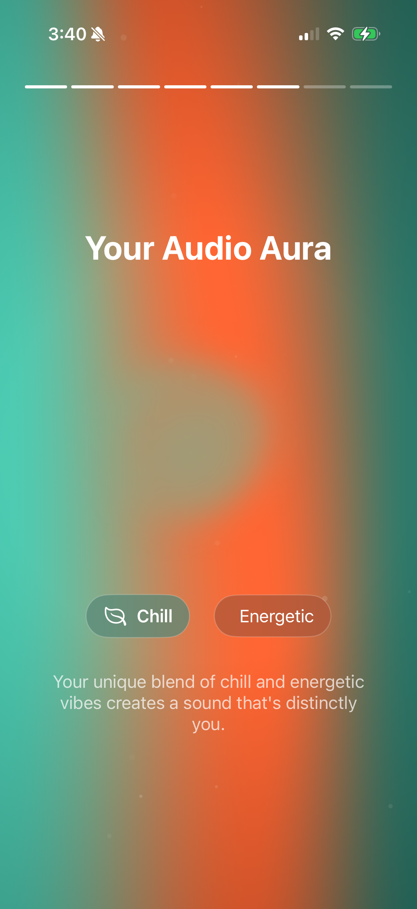
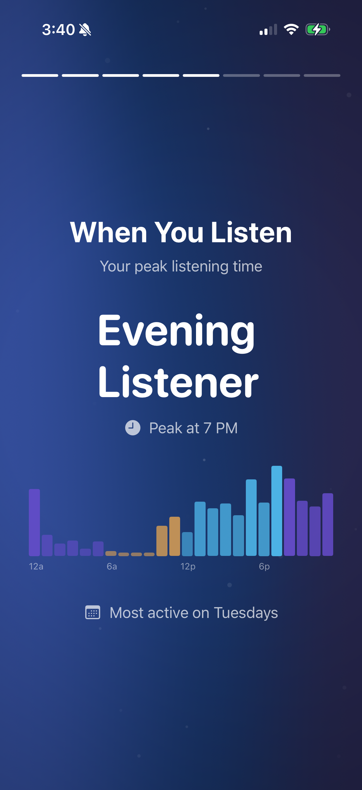
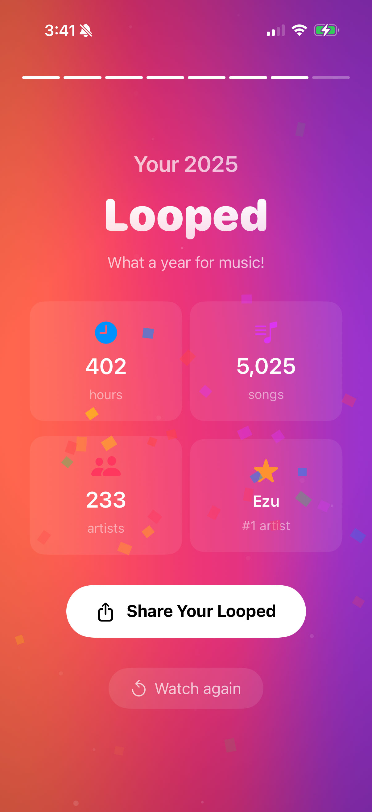
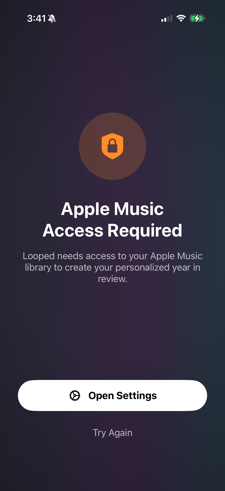

# Looped - Apple Music Year in Review

A year-in-review experience for Apple Music users, inspired by Spotify Wrapped. Built with SwiftUI for iOS 18+.

## Screenshots

| Welcome | Counters | Top Songs | Audio Aura |
|---------|----------|-----------|------------|
|  |  |  |  |

| Listening Patterns | Share | Permission Denied |
|--------------------|-------|-------------------|
|  |  |  |

## Features

- **Story-based Experience**: Instagram/Spotify Wrapped-style swipeable cards
- **Dynamic Gradients**: Animated mesh gradients that adapt to album artwork colors
- **8 Story Cards**:
  1. Welcome - Animated intro with year display
  2. Total Time - Animated counter showing listening hours
  3. Top Artist - Showcase of #1 artist with stats
  4. Top Songs - Ranked list of top 5 songs
  5. Top Genres - Visual breakdown with animated bars
  6. Listening Patterns - Time-of-day analysis
  7. Audio Aura - Personality insight based on music taste
  8. Summary - Stats recap with share functionality
- **MusicKit Integration**: Accesses user's Apple Music library
- **Beautiful Animations**: Particle effects, count-up animations, smooth transitions
- **Haptic Feedback**: Subtle haptics for navigation
- **Share Feature**: Export your wrapped summary

## Project Structure

```
Looped/
├── LoopedApp.swift                    # App entry point
├── ContentView.swift                  # Main view controller
├── Looped.entitlements               # MusicKit entitlement
│
├── Core/
│   ├── Extensions/
│   │   ├── Color+Extensions.swift    # Color manipulation
│   │   └── View+Extensions.swift     # View modifiers
│   └── Utilities/
│       └── HapticManager.swift       # Haptic feedback
│
├── Data/
│   ├── Models/
│   │   ├── ListeningStats.swift      # Main stats container
│   │   ├── ArtistStats.swift         # Artist statistics
│   │   ├── SongStats.swift           # Song statistics
│   │   ├── GenreStats.swift          # Genre breakdown
│   │   ├── ListeningPatterns.swift   # Time patterns
│   │   └── AudioAura.swift           # Mood/personality
│   └── Services/
│       ├── MusicKitService.swift     # MusicKit API
│       ├── StatsCalculationEngine.swift
│       └── ColorExtractionService.swift
│
├── Features/
│   ├── Onboarding/
│   │   └── OnboardingView.swift      # Permission request
│   ├── Loading/
│   │   └── LoadingView.swift         # Loading animation
│   └── Stories/
│       ├── StoryContainerView.swift  # Main container
│       ├── StoryContainerViewModel.swift
│       ├── Cards/
│       │   ├── WelcomeCard.swift
│       │   ├── TotalTimeCard.swift
│       │   ├── TopArtistCard.swift
│       │   ├── TopSongsCard.swift
│       │   ├── TopGenresCard.swift
│       │   ├── ListeningPatternsCard.swift
│       │   ├── AudioAuraCard.swift
│       │   └── SummaryCard.swift
│       └── Components/
│           ├── StoryProgressBar.swift
│           ├── AnimatedCounter.swift
│           └── AlbumArtworkView.swift
│
└── Design/
    ├── Theme/
    │   ├── LoopedTheme.swift         # Design system
    │   └── Typography.swift          # Font styles
    └── Components/
        ├── GradientBackground.swift  # Animated gradients
        ├── GlassCard.swift           # Glassmorphism
        ├── ParticleEmitterView.swift # Particle effects
        └── BlurredArtworkBackground.swift
```

## Requirements

- iOS 18.0+ (uses MeshGradient)
- Xcode 16.0+
- Apple Music subscription (for real data)
- MusicKit entitlement

## Setup

1. Open `Looped.xcodeproj` in Xcode
2. Select your development team in Signing & Capabilities
3. The MusicKit entitlement is already configured
4. Build and run on simulator or device

## Implementation Status

### Completed
- [x] Project structure and file organization
- [x] Data models (ListeningStats, ArtistStats, SongStats, etc.)
- [x] MusicKitService with authorization flow
- [x] StatsCalculationEngine for processing music data
- [x] ColorExtractionService for artwork colors
- [x] Design system (LoopedTheme, Typography)
- [x] All 8 story cards with animations
- [x] Story container with swipe navigation
- [x] Progress bar component
- [x] Onboarding view with permission request
- [x] Loading view with progress animation
- [x] ContentView with app state management
- [x] Particle effects and visual polish
- [x] Glassmorphism card components
- [x] Animated gradients (MeshGradient + LinearGradient)
- [x] Haptic feedback integration
- [x] Share functionality
- [x] "Watch Again" replay feature
- [x] Pulsing animation rings on welcome card
- [x] Vignette overlay for depth
- [x] Confetti celebration on summary card

### Technical Highlights

- **Zero external dependencies** - Built entirely with native frameworks
- **Modern Swift** - Uses Swift 6 concurrency, @Observable, async/await
- **MeshGradient** - iOS 18 fluid gradient animations
- **Canvas API** - Performant particle effects
- **MusicKit** - Native Apple Music integration

## Design Principles

1. **Dark Theme** - Black background makes colors pop
2. **Large Typography** - Bold, rounded fonts for stats
3. **Dynamic Color** - Gradients extracted from album artwork
4. **Smooth Motion** - Spring animations, 0.4s transitions
5. **Glassmorphism** - Ultra-thin material cards

## Sample Data

The app includes sample data for testing and preview purposes. When no Apple Music data is available, it falls back to realistic sample statistics.

## Key Files

| File | Purpose |
|------|---------|
| `MusicKitService.swift` | Apple Music API integration |
| `StatsCalculationEngine.swift` | Compute listening statistics |
| `StoryContainerView.swift` | Main story experience |
| `GradientBackground.swift` | Animated background gradients |
| `LoopedTheme.swift` | Design tokens and constants |

## Architecture

- **MVVM Pattern** - Views, ViewModels, and Models separation
- **Actor Isolation** - Thread-safe services with Swift actors
- **@Observable** - Modern SwiftUI state management
- **Sendable** - Safe concurrent data models

## Building

```bash
xcodebuild -project Looped.xcodeproj \
  -scheme Looped \
  -destination 'platform=iOS Simulator,name=iPhone 17 Pro' \
  build
```

Alternatively, run from Xcode to any physical device. Ensure a provisioning profile is set under **Signing & Capabilities** in Xcode. To avoid conflicts, the bundle identifier can be changed if needed, to something that is available and unregistered by another signing team.

## Roadmap

### More Stats Cards
- [ ] **Top Albums** - Showcase most-played albums with cover art grid
- [ ] **Monthly Breakdown** - Your top song for each month of the year
- [ ] **New Discoveries** - Artists you started listening to this year
- [ ] **Deep Cuts** - Songs you played way more than the average listener
- [ ] **Listening Streaks** - Longest consecutive days of listening
- [ ] **Seasonal Vibes** - How your taste changed across seasons
- [ ] **Decade on Apple Music** - Multi-year retrospective for long-time users
- [ ] **Artist Journey** - Timeline of when you discovered each top artist

### Playback Features
- [ ] **Mini Player** - Floating player to preview songs without leaving the app
- [ ] **Generate Playlist** - Create "Top Songs 2025" playlist directly in Apple Music
- [ ] **Play Top Artist** - One-tap to play your #1 artist's discography
- [ ] **Rediscover Playlist** - Songs you loved but haven't played recently
- [ ] **Queue Management** - Add top songs to current queue

### Sharing & Social
- [ ] **Instagram Stories Export** - Properly formatted vertical cards for Stories
- [ ] **Video Generation** - Animated video recap to share on social media
- [ ] **Compare with Friends** - Side-by-side stats comparison via SharePlay
- [ ] **Shareable Links** - Web preview of your wrapped stats

### UI/UX Enhancements
- [ ] **iPad Layout** - Optimized two-column layout for larger screens
- [ ] **Interactive Charts** - Tap into listening patterns for detailed breakdowns
- [ ] **Long-press Actions** - Quick actions on songs (add to library, share, etc.)
- [ ] **Accessibility** - VoiceOver improvements, Dynamic Type support
- [ ] **Localization** - Support for multiple languages

### Data & Insights
- [ ] **Year-over-Year** - Compare this year to previous years
- [ ] **Listening Predictions** - "You might hit 1000 hours by December"
- [ ] **Genre Evolution** - How your taste has shifted over time
- [ ] **Peak Listening Times** - Most active listening hours with context

### Technical Improvements
- [ ] **CloudKit Sync** - Persist historical stats across devices
- [ ] **Apple Watch App** - Glanceable stats on your wrist
- [ ] **Widgets** - Home screen widgets showing current year stats
- [ ] **Shortcuts Integration** - "Hey Siri, show my music wrapped"
- [ ] **Background Refresh** - Keep stats up-to-date automatically
- [ ] **Offline Support** - Cache stats for offline viewing

## Notes

- MusicKit requires an Apple Developer account with MusicKit capability
- The app uses sample data when running in simulator without Apple Music access
- Album artwork colors are extracted using Core Graphics for dynamic theming

## Generative AI Disclosure

This project was built with assistance from [Claude](https://claude.ai), an AI assistant by Anthropic. Claude helped with code generation, architecture decisions, and documentation.
